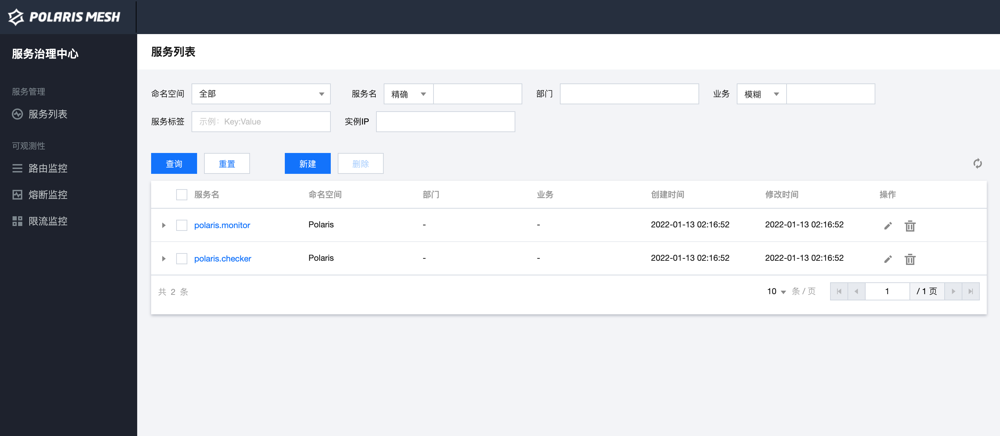

# Polaris helm

English | [简体中文](./README-zh.md)

This document describes how to install polaris service using helm chart.

## Prerequisites

Make sure k8s cluster is installed and helm is installed.

## Install polaris helm chart

### Standalone

You can modify `values.yaml` , set `global.mode` to `standalone` , then install using the command below,
replacing `${release_name}` with your desired release name.

```shell
$ cd deploy/helm
$ helm install ${release_name} . 
```

You can start directly with the following command:

```shell
$ cd deploy/helm
$ helm install ${release_name} . --set global.mode=standalone
```

### Cluster

You need to modify `values.yaml`, set `global.mode` to `cluster`, and set the address information
of `polaris.storage.db` and `polaris.storaate.redis`. Make sure your mysql has been initialized with the command below.

```shell
mysql -u $db_user -p $db_pwd -h $db_host < store/sqldb/polaris_server.sql
```

Once set up, install the chart with the following command.

```shell
$ cd deploy/helm
$ helm install ${release_name} . 
```

### Check the installation

After deployment, the pod can be observed to run normally with the following command:

```shell
$ kubectl get po -n polaris-system
NAME                                  READY   STATUS    RESTARTS   AGE
polaris-0                             2/2     Running   0          2m44s
polaris-prometheus-6cd7cd5fc6-gqtcz   2/2     Running   0          2m44s
```

If you configure `service.type` as `LoadBalancer` in `values.yaml`, you can use the `EXTERNAL-IP`:webPort of the polaris
service to access the Polaris page. If your k8s cluster does not support `LoadBalancer` , you can set `service.type`
to `NodePort` and access it through nodeip:nodeport . The page is as follows:


## Uninstall polaris helm chart

Uninstall your installed release with the command below, replacing `${release_name}` with the release name you used.

```shell
$ helm uninstall `${release_name}`
```

## Configuration

The currently supported configurations are as follows:

| Parameter                            | Description                              |
|--------------------------------------|--------------------------------------|
|global.mode                           | Cluster type, supports `cluter` and `standalone` , indicating cluster version and stand-alone version|
|polaris.image.repository              | polaris-server image repository address|
|polaris.image.tag                     | polaris-server image tag|
|polaris.image.pullPolicy              | polaris-server image pull policy|
|polaris.limit.cpu                     | polaris-server cpu limit|
|polaris.limit.memory                  | polaris-server memory limit|
|polaris.console.image.repository      | polaris-console mage repository address|
|polaris.console.image.tag             | polaris-console image tag|
|polaris.console.image.pullPolicy      | polaris-console image pull policy|
|polaris.console.limit.cpu             | polaris-console cpu limit|
|polaris.console.limit.memory          | polaris-console memory limit|
|polaris.replicaCount                  | polaris replicas|
|polaris.storage.db.address            | polaris Cluster version, the address of mysql|
|polaris.storage.db.name               | polaris Cluster version, the database name of mysql|
|polaris.storage.db.user               | polaris Cluster version, the user of mysql|
|polaris.storage.db.password           | polaris Cluster version, the password of mysql|
|polaris.storage.redis.address         | polaris Cluster version, the address of redis|
|polaris.storage.redis.password        | polaris Cluster version, the password of redis|
|polaris.storage.service.type          | polaris service type|
|polaris.storage.service.httpPort      | polaris service expose, polaris-server listening http port number|
|polaris.storage.service.grpcPort      | polaris service expose, polaris-server listening grpc port number|
|polaris.storage.service.webPort       | polaris service expose, polaris-server listening web  port number|
|polaris.auth.consoleOpen              | polaris open the console interface auth, open the default|
|polaris.auth.clientOpen               | polaris open the client interface auth, close the default|
|monitor.port                          | The port through which the client reports monitoring information|
|installation.namespace                | namespace for polaris installation|
